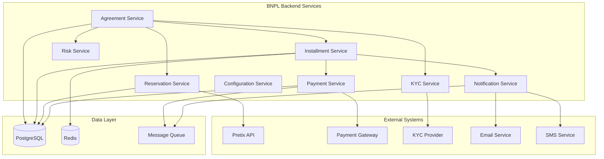
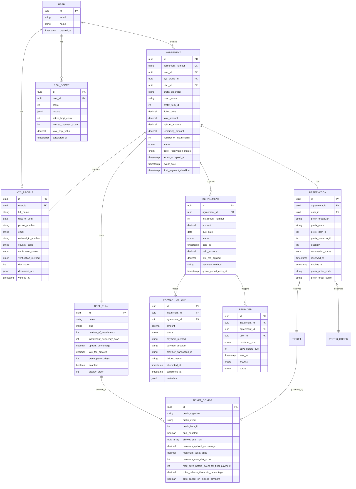
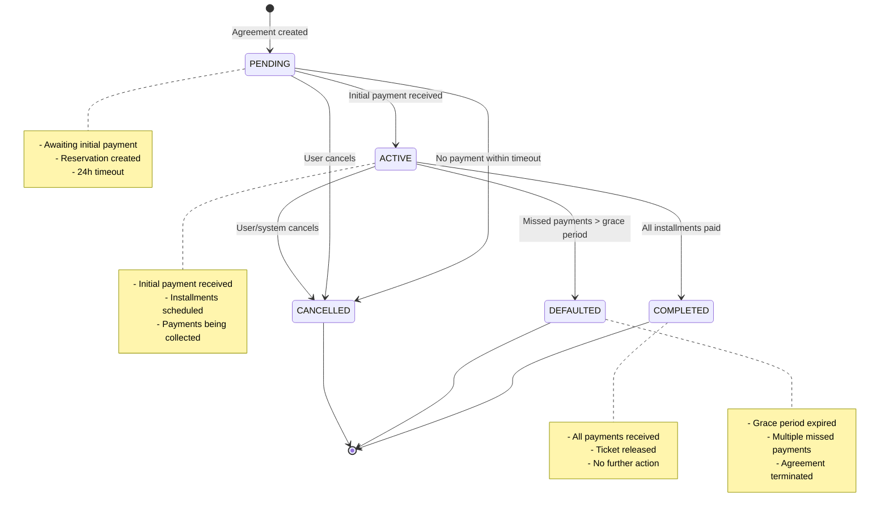
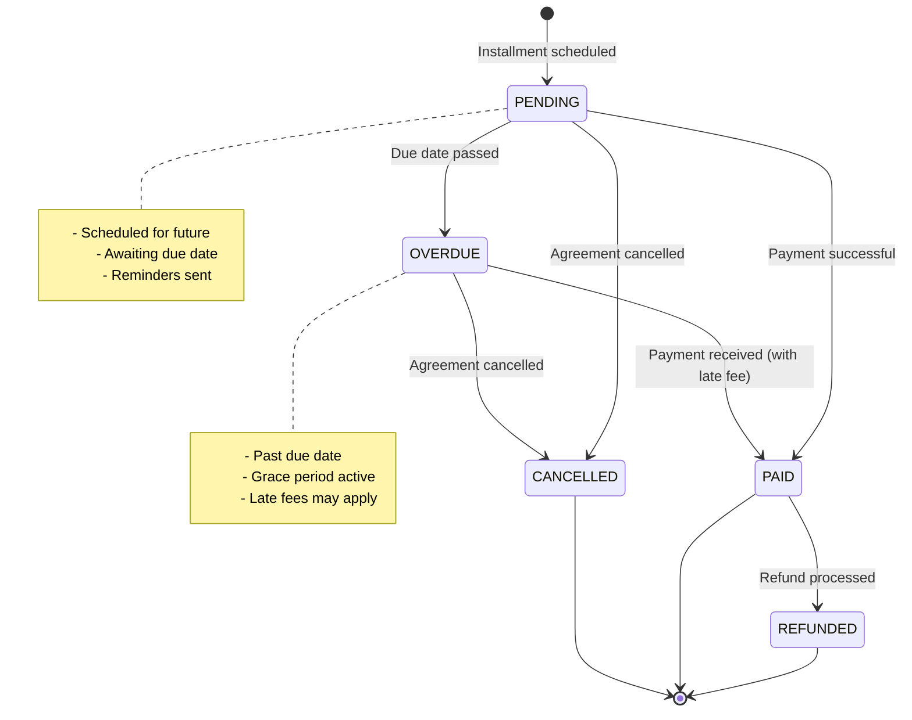
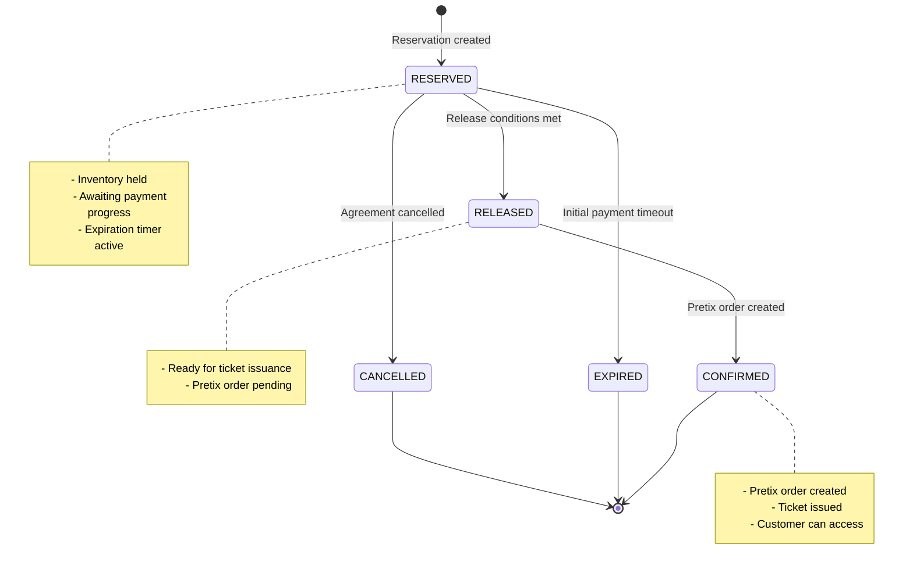

# BNPL Backend Technical Specification

## Document Information

- **Version:** 1.0
- **Date:** March 2026
- **Status:** Final
- **Audience:** Backend Engineers, Solution Architects, QA Engineers, DevOps, API Integrators

---

## 1. Overview

### 1.1 Purpose

The Buy Now Pay Later (BNPL) backend module enables customers to purchase event tickets through installment payments while ensuring ticket organizers receive guaranteed payment and tickets are only delivered when payment conditions are satisfied.

### 1.2 Goals

**Primary Goals:**
1. Enable flexible payment options for ticket purchases
2. Reduce cart abandonment by lowering upfront payment barriers
3. Maintain ticket inventory integrity during payment periods
4. Minimize financial risk through KYC verification and risk scoring
5. Automate payment collection, reminders, and enforcement
6. Provide clear visibility into payment status for all stakeholders

**Backend-Specific Goals:**
1. Process BNPL transactions reliably with strong consistency
2. Handle payment schedules and automated collections
3. Enforce business rules for reservations, releases, and cancellations
4. Maintain audit trails for compliance and dispute resolution
5. Support high availability and horizontal scalability
6. Provide real-time status updates and webhooks

### 1.3 System Interactions

The BNPL backend interacts with multiple systems:

```
┌─────────────────────────────────────────────────────────────────┐
│                        BNPL Backend Core                         │
│  ┌──────────────┐  ┌──────────────┐  ┌──────────────┐         │
│  │  Agreement   │  │  Installment │  │  Reservation │         │
│  │   Service    │  │   Service    │  │   Service    │         │
│  └──────────────┘  └──────────────┘  └──────────────┘         │
│         │                  │                  │                  │
└─────────┼──────────────────┼──────────────────┼─────────────────┘
          │                  │                  │
          ├──────────────────┴──────────────────┴─────┐
          │                                             │
    ┌─────▼─────┐                                 ┌────▼─────┐
    │  Pretix   │                                 │ Payment  │
    │ Ticketing │◄────────────────────────────────┤ Gateway  │
    │    API    │     (Order Creation)            │          │
    └───────────┘                                 └──────────┘
          │                                             │
          │                                             │
    ┌─────▼─────┐                                 ┌────▼─────┐
    │    KYC    │                                 │  Risk    │
    │  Service  │                                 │ Engine   │
    └───────────┘                                 └──────────┘
          │                                             │
          │                                             │
    ┌─────▼──────────────────────────────────────┬────▼─────┐
    │         Notification Service                │   Admin  │
    │  (Email, SMS, Push)                        │    API   │
    └────────────────────────────────────────────┴──────────┘
```

**Integration Points:**

1. **Ticketing System (Pretix API)**
   - Query event and ticket availability
   - Create reservations (hold inventory)
   - Create final orders (issue tickets)
   - Handle refunds and cancellations

2. **Payment Gateway**
   - Process initial and installment payments
   - Handle payment method tokenization
   - Manage automated recurring payments
   - Process refunds

3. **KYC Service**
   - Verify customer identity
   - Validate age requirements
   - Store verification documents
   - Update verification status

4. **Risk Engine**
   - Calculate user risk scores
   - Flag suspicious patterns
   - Assess fraud probability
   - Update scores based on behavior

5. **Notification Service**
   - Send payment reminders
   - Notify about payment status
   - Alert on missed payments
   - Confirmation messages

6. **Admin API**
   - Configure BNPL rules per ticket
   - Monitor agreement status
   - Override decisions
   - Generate reports

### 1.4 Business Outcomes

**For Customers:**
- Access to tickets with lower upfront cost
- Flexible payment scheduling
- Clear payment visibility
- No interest charges

**For Organizers:**
- Increased ticket sales
- Reduced abandonment
- Guaranteed payment
- Automated collection

**For Platform:**
- New revenue stream (fees)
- Increased transaction volume
- Customer loyalty
- Competitive advantage

---

## 2. Scope

### 2.1 In Scope

**Core BNPL Functionality:**
- BNPL agreement creation and lifecycle management
- Installment schedule generation and tracking
- Payment processing and reconciliation
- Ticket reservation management
- Automated payment collection
- Payment reminder system
- Risk assessment and KYC verification
- Grace period and late fee handling
- Ticket release logic
- Agreement cancellation and refunds

**API Capabilities:**
- Public API for customer-facing operations
- Admin API for configuration and monitoring
- Webhook endpoints for external integrations
- Real-time status queries

**Data Management:**
- Persistent storage of all entities
- Audit logging
- Data retention policies
- GDPR compliance features

**Operational Features:**
- Health checks and monitoring
- Error handling and retry logic
- Idempotency guarantees
- Rate limiting

### 2.2 Out of Scope

**Not Included:**
- Frontend implementation (separate concern)
- Payment gateway implementation (third-party)
- KYC verification service (third-party or separate service)
- Email/SMS delivery infrastructure (third-party)
- Credit reporting integration
- Dispute resolution workflow
- Manual underwriting system
- Currency conversion
- Multi-language content management

### 2.3 Assumptions

**Technical Assumptions:**
1. PostgreSQL database available (Supabase)
2. Payment gateway supports tokenization and recurring payments
3. External services have reasonable SLAs (<500ms p95)
4. Event horizon: max 12 months future booking
5. Max installment period: 6 months
6. Single currency per transaction (EUR)

**Business Assumptions:**
1. Minimum customer age: 18 years
2. Maximum active BNPL agreements per user: 3
3. Maximum total BNPL value per user: €5,000
4. Minimum ticket price for BNPL: €50
5. Maximum ticket price for BNPL: €2,000
6. Payment processing time: <5 seconds
7. Notification delivery SLA: <1 minute

**Operational Assumptions:**
1. 24/7 operation required
2. Peak load: 1,000 requests/second
3. Average agreement creation: 100/minute
4. Daily payment processing: 10,000 installments
5. 99.9% uptime requirement

### 2.4 External Dependencies

**Required Services:**

1. **Pretix Ticketing API**
   - Endpoint: `https://pretix.eu/api/v1/`
   - Authentication: API Token
   - Rate Limit: 100 req/sec
   - Operations: Event queries, inventory management, order creation

2. **Payment Gateway** (e.g., Stripe, Adyen)
   - Tokenization support required
   - Recurring payment capability
   - Webhook support
   - 3DS2 compliance

3. **KYC Service** (e.g., Onfido, Jumio)
   - Identity verification
   - Document validation
   - Age verification
   - API or SDK integration

4. **Notification Service** (e.g., SendGrid, Twilio)
   - Email delivery
   - SMS delivery
   - Template management
   - Delivery tracking

5. **PostgreSQL Database** (Supabase)
   - Version: 14+
   - Extensions: uuid-ossp, pgcrypto
   - Connection pooling
   - Backup/recovery

**Optional Services:**

1. **Fraud Detection Service** (e.g., Sift, Forter)
2. **Analytics Platform** (e.g., Mixpanel, Amplitude)
3. **Monitoring** (e.g., Datadog, New Relic)
4. **Logging** (e.g., Elasticsearch, CloudWatch)

---

## 3. Core Business Concepts

### 3.1 BNPL Agreement

**Definition:**
A contractual arrangement between a customer and the platform to pay for a ticket purchase over time through scheduled installments.

**Lifecycle States:**
```
PENDING → ACTIVE → COMPLETED
   ↓         ↓
CANCELLED  DEFAULTED
```

**State Transitions:**
- `PENDING`: Agreement created, awaiting initial payment
- `ACTIVE`: Initial payment received, installments scheduled
- `COMPLETED`: All payments received
- `CANCELLED`: Agreement terminated before completion
- `DEFAULTED`: Missed payments beyond grace period

**Key Attributes:**
- Unique agreement number
- Associated user and ticket
- Payment plan reference
- Financial amounts (total, upfront, remaining)
- Status and timestamps
- Event date and payment deadline

**Business Rules:**
1. Agreement becomes ACTIVE only after successful initial payment
2. Initial payment must be >= configured upfront percentage
3. Final payment must occur before event date minus deadline days
4. Agreement automatically CANCELLED if deadline missed
5. Agreement moves to DEFAULTED after grace period exhausted

### 3.2 Installment Plan

**Definition:**
A template defining the structure of a BNPL payment arrangement, including number of payments, timing, and financial terms.

**Types:**
1. **Pay in 3**: 3 equal installments over 60 days
2. **Pay in 4**: 4 equal installments over 90 days
3. **Monthly Plan**: 6 monthly installments

**Key Attributes:**
- Plan name and identifier
- Number of installments
- Frequency (days between payments)
- Upfront percentage
- Late fee structure
- Grace period duration

**Configuration:**
Plans are configurable per ticket type via admin API.

### 3.3 Installment Schedule

**Definition:**
The specific payment schedule generated for a BNPL agreement, consisting of individual installments with due dates and amounts.

**Installment States:**
```
PENDING → PAID
   ↓        ↑
OVERDUE ────┘
   ↓
CANCELLED/REFUNDED
```

**Generation Logic:**
```typescript
// Pseudocode
function generateSchedule(agreement, plan) {
  const installments = [];
  const upfrontAmount = agreement.totalAmount * (plan.upfrontPercentage / 100);
  const remainingAmount = agreement.totalAmount - upfrontAmount;
  const installmentCount = plan.numberOfInstallments;
  const perInstallment = remainingAmount / (installmentCount - 1);

  // First installment (upfront)
  installments.push({
    number: 1,
    amount: upfrontAmount,
    dueDate: now(),
    status: 'PENDING'
  });

  // Subsequent installments
  for (let i = 2; i <= installmentCount; i++) {
    installments.push({
      number: i,
      amount: perInstallment,
      dueDate: now() + (i - 1) * plan.frequencyDays,
      status: 'PENDING'
    });
  }

  return installments;
}
```

**Business Rules:**
1. First installment due immediately (upfront payment)
2. Subsequent installments due at regular intervals
3. All installments must be paid before event date minus deadline
4. Overdue status applied day after due date (after grace period)
5. Late fees applied after grace period expires

### 3.4 Ticket Reservation

**Definition:**
A temporary hold on ticket inventory that prevents the ticket from being sold to others while BNPL payment is in progress.

**Reservation States:**
```
RESERVED → RELEASED
    ↓         ↓
 EXPIRED   CONFIRMED
    ↓
CANCELLED
```

**State Definitions:**
- `RESERVED`: Initial state, inventory held
- `RELEASED`: Ticket ready for delivery, awaiting order creation
- `CONFIRMED`: Pretix order created, ticket issued
- `EXPIRED`: Reservation timeout (no initial payment)
- `CANCELLED`: Agreement cancelled, inventory returned

**Key Attributes:**
- Agreement reference
- Ticket details (organizer, event, item, variation)
- Quantity
- Reservation and expiration timestamps
- Pretix order details (when confirmed)

**Business Rules:**
1. Reservation created immediately upon agreement creation
2. Reduces available ticket inventory
3. Reservation expires if initial payment not received within timeout
4. Ticket released when payment threshold reached
5. Inventory returned to pool upon cancellation

### 3.5 Payment Attempt

**Definition:**
A record of an attempt to collect payment for an installment, including success/failure status and provider details.

**Attempt States:**
- `PENDING`: Payment initiated
- `SUCCEEDED`: Payment successful
- `FAILED`: Payment declined or error
- `CANCELLED`: Attempt manually cancelled

**Key Attributes:**
- Installment reference
- Amount attempted
- Payment method
- Provider transaction ID
- Status and timestamps
- Failure reason (if applicable)

**Retry Logic:**
```
Attempt 1: Immediate
  ↓ (if failed)
Attempt 2: +24 hours
  ↓ (if failed)
Attempt 3: +48 hours
  ↓ (if failed)
Attempt 4: +72 hours
  ↓ (if failed)
Manual intervention required
```

**Business Rules:**
1. Max 4 automatic retry attempts
2. Exponential backoff between retries
3. Different payment methods can be tried
4. All attempts logged for audit
5. User notified after each failed attempt

### 3.6 KYC Profile

**Definition:**
Customer identity verification data required to assess eligibility and mitigate fraud risk.

**Verification Levels:**
1. **Basic**: Name, DOB, email, phone (instant)
2. **Document**: ID document upload (1-24 hours)
3. **Biometric**: Selfie + liveness check (1-24 hours)

**Key Attributes:**
- User reference
- Full legal name
- Date of birth
- Contact information
- National ID number (encrypted)
- Verification status and method
- Document URLs
- Risk score

**Verification Status:**
- `PENDING`: Submitted, awaiting review
- `VERIFIED`: Approved
- `REJECTED`: Failed verification

**Business Rules:**
1. BNPL requires at least Basic verification
2. High-value tickets (>€500) require Document verification
3. Age must be 18+ at verification time
4. Verification valid for 12 months
5. Re-verification required after status change

### 3.7 Risk Score

**Definition:**
A numerical assessment (0-100) of a user's creditworthiness and fraud probability, used to determine BNPL eligibility and limits.

**Score Ranges:**
- 0-30: High risk (rejected)
- 31-50: Medium risk (limited approval)
- 51-70: Low risk (standard approval)
- 71-100: Very low risk (premium approval)

**Calculation Factors:**
```typescript
interface RiskFactors {
  // Positive factors
  completedAgreements: number;        // +5 per completed
  onTimePaymentHistory: number;       // +10 if 100%
  accountAge: number;                 // +5 if >90 days
  verifiedKYC: boolean;               // +10 if verified

  // Negative factors
  activeBNPLCount: number;            // -10 if >3
  missedPaymentCount: number;         // -15 per missed
  totalBNPLValue: number;             // -10 if >€5,000
  newAccount: boolean;                // -5 if <30 days

  // Fraud signals
  multipleDevices: boolean;           // -20 if true
  velocityAlert: boolean;             // -15 if true
  blacklistMatch: boolean;            // -50 if true
}

function calculateRiskScore(factors: RiskFactors): number {
  let score = 70; // Base score

  // Apply positive factors
  score += factors.completedAgreements * 5;
  score += factors.onTimePaymentHistory;
  score += factors.accountAge > 90 ? 5 : 0;
  score += factors.verifiedKYC ? 10 : 0;

  // Apply negative factors
  score -= factors.activeBNPLCount > 3 ? 10 : 0;
  score -= factors.missedPaymentCount * 15;
  score -= factors.totalBNPLValue > 5000 ? 10 : 0;
  score -= factors.newAccount ? 5 : 0;

  // Apply fraud signals
  score -= factors.multipleDevices ? 20 : 0;
  score -= factors.velocityAlert ? 15 : 0;
  score -= factors.blacklistMatch ? 50 : 0;

  return Math.max(0, Math.min(100, score));
}
```

**Recalculation Triggers:**
- New BNPL agreement created
- Payment made or missed
- Agreement completed
- Periodic batch recalculation (daily)

**Business Rules:**
1. Score calculated on first BNPL request
2. Updated after each payment event
3. Minimum score required for approval (configurable per ticket)
4. Score visible to user in dashboard
5. Historical scores retained for audit

### 3.8 Ticket Release Rule

**Definition:**
Conditions that must be met before a reserved ticket is delivered to the customer.

**Release Strategies:**

**Strategy 1: Full Payment (Default)**
```
Condition: 100% of total amount paid
Action: Immediate ticket release
```

**Strategy 2: Threshold + Proximity**
```
Condition: X% paid AND event within Y days
Example: 50% paid AND event within 7 days
Action: Ticket release
```

**Strategy 3: Custom**
```
Condition: Configurable per organizer
Example: Initial payment + 2 installments paid
Action: Ticket release
```

**Implementation Logic:**
```typescript
interface ReleaseRule {
  thresholdPercentage: number;      // 0-100
  daysBeforeEvent: number;          // 0-365
  requireAllPayments: boolean;      // true/false
}

function shouldReleaseTicket(
  agreement: Agreement,
  installments: Installment[],
  rule: ReleaseRule
): boolean {
  const totalPaid = calculateTotalPaid(installments);
  const percentPaid = (totalPaid / agreement.totalAmount) * 100;
  const daysToEvent = calculateDaysToEvent(agreement.eventDate);

  if (rule.requireAllPayments) {
    return percentPaid === 100;
  }

  return (
    percentPaid >= rule.thresholdPercentage &&
    daysToEvent <= rule.daysBeforeEvent
  );
}
```

**Business Rules:**
1. Default rule: 100% payment required
2. Organizers can customize per event
3. Ticket cannot be released after event date
4. Once released, cannot be revoked
5. Release triggers Pretix order creation

### 3.9 Payment Reminder

**Definition:**
Automated notifications sent to customers about upcoming, due, or overdue payments.

**Reminder Types:**

| Type | Timing | Priority | Channels |
|------|--------|----------|----------|
| UPCOMING | 7 days before | Low | Email |
| DUE_SOON | 1 day before | Medium | Email + SMS |
| DUE_TODAY | Due date | High | Email + SMS + Push |
| OVERDUE | 1 day after | Critical | Email + SMS + Push |
| FINAL_WARNING | Grace period end | Critical | Email + SMS + Push |

**Reminder Schedule:**
```
Payment Due: Day 0
              ↓
Day -7:  UPCOMING reminder sent
Day -1:  DUE_SOON reminder sent
Day 0:   DUE_TODAY reminder sent
Day +1:  Payment status checked
         ↓
         OVERDUE reminder sent (if not paid)
Day +3:  Grace period ends
         ↓
         FINAL_WARNING sent
Day +5:  Late fee applied
         ↓
         Agreement at risk of cancellation
```

**Business Rules:**
1. Reminders sent via configured channels
2. User can opt out of certain reminder types
3. All reminders logged for audit
4. Click tracking for email reminders
5. Delivery status monitored
6. Failed deliveries trigger retry
7. Maximum 3 reminders per day per user

### 3.10 Cancellation Rule

**Definition:**
Conditions and procedures for terminating a BNPL agreement before completion.

**Cancellation Types:**

**1. User-Initiated Cancellation**
- Allowed: Before first payment or within cooling-off period (14 days)
- Refund: Full refund of payments made
- Penalty: None (within cooling-off) or cancellation fee

**2. System-Initiated Cancellation**
- Trigger: Missed payments beyond grace period
- Trigger: Payment deadline passed without completion
- Trigger: Fraud detected
- Refund: Partial refund based on policy

**3. Organizer-Initiated Cancellation**
- Trigger: Event cancelled
- Refund: Full refund of all payments
- Penalty: None

**Cancellation Process:**
```typescript
async function cancelAgreement(
  agreementId: string,
  reason: CancellationReason,
  initiatedBy: 'user' | 'system' | 'organizer'
) {
  // 1. Load agreement and validate cancellation allowed
  const agreement = await getAgreement(agreementId);
  validateCancellationAllowed(agreement, reason);

  // 2. Calculate refund amount
  const refundAmount = calculateRefund(agreement, reason);

  // 3. Update agreement status
  await updateAgreementStatus(agreementId, 'CANCELLED');

  // 4. Cancel pending installments
  await cancelPendingInstallments(agreementId);

  // 5. Release ticket reservation
  await releaseReservation(agreement.reservationId);

  // 6. Process refund if applicable
  if (refundAmount > 0) {
    await processRefund(agreementId, refundAmount);
  }

  // 7. Notify user
  await sendCancellationNotification(agreement.userId, refundAmount);

  // 8. Update risk score
  await updateRiskScore(agreement.userId, 'CANCELLATION');

  // 9. Emit event
  await emitEvent('agreement.cancelled', {
    agreementId,
    reason,
    refundAmount
  });
}
```

**Business Rules:**
1. User can cancel within 14-day cooling-off period (EU law)
2. After cooling-off, cancellation fee applies
3. System cancels if payment deadline missed
4. Partial refunds pro-rated based on payments made
5. Cancellation freezes new BNPL requests for 30 days
6. Multiple cancellations reduce risk score

### 3.11 Refund Rule

**Definition:**
Policies governing the return of funds when an agreement is cancelled or modified.

**Refund Scenarios:**

| Scenario | Refund Amount | Processing Time |
|----------|---------------|-----------------|
| Event cancelled | 100% of paid amount | 5-10 business days |
| User cancels (cooling-off) | 100% of paid amount | 5-10 business days |
| User cancels (after cooling-off) | Paid - cancellation fee | 5-10 business days |
| System cancels (deadline) | Paid - processing fees | 5-10 business days |
| Missed payments (defaulted) | 0% | N/A |
| Partial refund (organizer) | Per organizer policy | 5-10 business days |

**Refund Calculation:**
```typescript
interface RefundPolicy {
  cancellationFee: number;          // Fixed fee
  processingFeePercentage: number;  // % of transaction
  minimumRefund: number;            // Min amount to refund
}

function calculateRefund(
  agreement: Agreement,
  installments: Installment[],
  reason: CancellationReason,
  policy: RefundPolicy
): number {
  const totalPaid = calculateTotalPaid(installments);

  switch (reason) {
    case 'EVENT_CANCELLED':
      return totalPaid; // Full refund

    case 'USER_INITIATED_COOLING_OFF':
      return totalPaid; // Full refund

    case 'USER_INITIATED':
      const afterFee = totalPaid - policy.cancellationFee;
      return Math.max(0, afterFee);

    case 'DEADLINE_MISSED':
      const processingFee = totalPaid * policy.processingFeePercentage;
      const afterProcessing = totalPaid - processingFee;
      return Math.max(policy.minimumRefund, afterProcessing);

    case 'DEFAULTED':
      return 0; // No refund for defaults

    default:
      return 0;
  }
}
```

**Processing Steps:**
1. Calculate refund amount based on policy
2. Create refund record in database
3. Initiate payment gateway refund
4. Update agreement financial records
5. Send confirmation to user
6. Update accounting records
7. Emit refund event for reporting

**Business Rules:**
1. Refunds processed to original payment method
2. Partial refunds allowed for multi-installment agreements
3. Refund cannot exceed total paid
4. Minimum refund threshold: €5
5. Refund status tracked separately
6. Failed refunds retried automatically
7. Manual refund option for support team

---

## 4. High-Level Backend Architecture

### 4.1 Service Architecture

The BNPL backend follows a **modular monolith** architecture with clear service boundaries, preparing for future microservices migration if needed.



### 4.2 Service Responsibilities

#### 4.2.1 Agreement Service

**Responsibility:**
Manages the lifecycle of BNPL agreements from creation to completion or cancellation.

**Core Operations:**
- Create new BNPL agreements
- Validate eligibility and business rules
- Update agreement status
- Handle cancellations
- Calculate financial summaries
- Enforce payment deadlines

**Key APIs:**
```typescript
interface AgreementService {
  // Creation
  createAgreement(request: CreateAgreementRequest): Promise<Agreement>;
  validateEligibility(userId: string, ticketId: number, amount: number): Promise<EligibilityResult>;

  // Retrieval
  getAgreement(agreementId: string): Promise<Agreement>;
  getUserAgreements(userId: string, filters?: AgreementFilters): Promise<Agreement[]>;

  // Updates
  updateAgreementStatus(agreementId: string, status: AgreementStatus): Promise<void>;
  recordPayment(agreementId: string, installmentId: string, amount: number): Promise<void>;

  // Lifecycle
  cancelAgreement(agreementId: string, reason: CancellationReason): Promise<void>;
  completeAgreement(agreementId: string): Promise<void>;

  // Business logic
  checkPaymentDeadline(agreementId: string): Promise<DeadlineStatus>;
  calculateRefund(agreementId: string, reason: CancellationReason): Promise<number>;
}
```

**Dependencies:**
- Installment Service (schedule generation)
- Reservation Service (ticket holding)
- KYC Service (verification check)
- Risk Service (score check)
- Payment Service (initial payment)

**Data Ownership:**
- `bnpl_agreements` table
- Agreement lifecycle events

#### 4.2.2 Installment Service

**Responsibility:**
Manages payment schedules, tracks individual installments, and coordinates payment collection.

**Core Operations:**
- Generate installment schedules
- Track installment status
- Process due date checks
- Apply late fees
- Handle grace periods
- Trigger payment collection

**Key APIs:**
```typescript
interface InstallmentService {
  // Schedule management
  generateSchedule(agreementId: string, planId: string): Promise<Installment[]>;
  getInstallments(agreementId: string): Promise<Installment[]>;
  getUpcomingInstallments(userId: string, days: number): Promise<Installment[]>;
  getOverdueInstallments(userId: string): Promise<Installment[]>;

  // Payment processing
  markInstallmentPaid(installmentId: string, paymentId: string): Promise<void>;
  markInstallmentOverdue(installmentId: string): Promise<void>;
  applyLateFee(installmentId: string, amount: number): Promise<void>;

  // Business logic
  checkDueDates(): Promise<DueInstallment[]>;
  calculateNextPaymentAmount(agreementId: string): Promise<number>;
  canSkipInstallment(installmentId: string): Promise<boolean>;
}
```

**Dependencies:**
- Payment Service (payment processing)
- Notification Service (reminders)
- Agreement Service (status updates)

**Data Ownership:**
- `installment_schedules` table
- Installment state transitions

**Background Jobs:**
```typescript
// Cron: Every day at 00:00 UTC
async function checkDueDatesJob() {
  const dueInstallments = await installmentService.checkDueDates();

  for (const installment of dueInstallments) {
    if (installment.dueDate === today()) {
      await notificationService.sendDueTodayReminder(installment);
    }

    if (installment.dueDate < today() && installment.status === 'PENDING') {
      await installmentService.markInstallmentOverdue(installment.id);
      await notificationService.sendOverdueNotification(installment);
    }

    if (isGracePeriodExpired(installment)) {
      await installmentService.applyLateFee(installment.id, LATE_FEE_AMOUNT);
    }
  }
}

// Cron: Every hour
async function processAutomaticPaymentsJob() {
  const dueInstallments = await installmentService.getDueForAutoPayment();

  for (const installment of dueInstallments) {
    await paymentService.processAutomaticPayment(installment);
  }
}
```

#### 4.2.3 Reservation Service

**Responsibility:**
Manages ticket inventory reservations during BNPL payment periods and coordinates ticket release.

**Core Operations:**
- Create ticket reservations
- Check release conditions
- Release tickets for order creation
- Handle reservation expiration
- Return inventory on cancellation

**Key APIs:**
```typescript
interface ReservationService {
  // Reservation management
  createReservation(request: CreateReservationRequest): Promise<Reservation>;
  getReservation(reservationId: string): Promise<Reservation>;
  getUserReservations(userId: string): Promise<Reservation[]>;

  // Release logic
  checkReleaseConditions(reservationId: string): Promise<boolean>;
  releaseTicket(reservationId: string): Promise<PretixOrder>;

  // Lifecycle
  expireReservation(reservationId: string): Promise<void>;
  cancelReservation(reservationId: string): Promise<void>;

  // Integration
  syncWithPretix(reservationId: string): Promise<void>;
}
```

**Integration with Pretix:**
```typescript
async function releaseTicket(reservationId: string): Promise<PretixOrder> {
  const reservation = await getReservation(reservationId);
  const agreement = await agreementService.getAgreement(reservation.agreementId);

  // 1. Verify release conditions met
  if (!await checkReleaseConditions(reservationId)) {
    throw new Error('Release conditions not met');
  }

  // 2. Create Pretix order
  const order = await pretixClient.createOrder({
    email: agreement.email,
    locale: agreement.locale,
    positions: [{
      item: reservation.itemId,
      variation: reservation.variationId,
      price: agreement.ticketPrice,
    }],
    payment_provider: 'bnpl',
  });

  // 3. Update reservation
  await updateReservation(reservationId, {
    status: 'CONFIRMED',
    pretixOrderCode: order.code,
    pretixOrderSecret: order.secret,
    confirmedAt: new Date(),
  });

  // 4. Emit event
  await emitEvent('reservation.released', {
    reservationId,
    agreementId: agreement.id,
    orderCode: order.code,
  });

  return order;
}
```

**Dependencies:**
- Pretix API (order creation)
- Agreement Service (status checks)
- Configuration Service (release rules)

**Data Ownership:**
- `ticket_reservations` table
- Pretix order references

**Background Jobs:**
```typescript
// Cron: Every hour
async function checkReservationExpirations() {
  const expired = await reservationService.getExpiredReservations();

  for (const reservation of expired) {
    await reservationService.expireReservation(reservation.id);
    await agreementService.cancelAgreement(
      reservation.agreementId,
      'RESERVATION_EXPIRED'
    );
  }
}

// Cron: Every 30 minutes
async function checkTicketReleaseEligibility() {
  const pending = await reservationService.getPendingReleases();

  for (const reservation of pending) {
    if (await reservationService.checkReleaseConditions(reservation.id)) {
      await reservationService.releaseTicket(reservation.id);
    }
  }
}
```

#### 4.2.4 Payment Service

**Responsibility:**
Handles all payment processing, including initial payments, installments, refunds, and payment gateway integration.

**Core Operations:**
- Process payments
- Tokenize payment methods
- Handle automatic payments
- Process refunds
- Retry failed payments
- Reconcile transactions

**Key APIs:**
```typescript
interface PaymentService {
  // Payment processing
  processPayment(request: PaymentRequest): Promise<PaymentResult>;
  processAutomaticPayment(installmentId: string): Promise<PaymentResult>;
  retryFailedPayment(attemptId: string): Promise<PaymentResult>;

  // Payment methods
  tokenizePaymentMethod(userId: string, paymentDetails: PaymentDetails): Promise<string>;
  deletePaymentMethod(userId: string, tokenId: string): Promise<void>;

  // Refunds
  processRefund(agreementId: string, amount: number, reason: string): Promise<RefundResult>;

  // Queries
  getPaymentAttempts(installmentId: string): Promise<PaymentAttempt[]>;
  getPaymentStatus(attemptId: string): Promise<PaymentStatus>;
}
```

**Payment Flow:**
```typescript
async function processPayment(request: PaymentRequest): Promise<PaymentResult> {
  // 1. Create payment attempt
  const attempt = await createPaymentAttempt({
    installmentId: request.installmentId,
    agreementId: request.agreementId,
    amount: request.amount,
    paymentMethod: request.paymentMethod,
    status: 'PENDING',
  });

  try {
    // 2. Call payment gateway
    const result = await paymentGateway.charge({
      amount: request.amount,
      currency: 'EUR',
      paymentToken: request.paymentToken,
      metadata: {
        agreementId: request.agreementId,
        installmentId: request.installmentId,
        attemptId: attempt.id,
      },
    });

    // 3. Update attempt status
    await updatePaymentAttempt(attempt.id, {
      status: 'SUCCEEDED',
      providerTransactionId: result.transactionId,
      completedAt: new Date(),
    });

    // 4. Update installment
    await installmentService.markInstallmentPaid(
      request.installmentId,
      attempt.id
    );

    // 5. Update agreement
    await agreementService.recordPayment(
      request.agreementId,
      request.installmentId,
      request.amount
    );

    // 6. Check if agreement complete
    const agreement = await agreementService.getAgreement(request.agreementId);
    if (agreement.remainingAmount === 0) {
      await agreementService.completeAgreement(agreement.id);
    }

    // 7. Check ticket release
    await reservationService.checkReleaseConditions(agreement.reservationId);

    // 8. Emit event
    await emitEvent('payment.succeeded', {
      agreementId: request.agreementId,
      installmentId: request.installmentId,
      amount: request.amount,
    });

    return { success: true, attemptId: attempt.id };

  } catch (error) {
    // Handle failure
    await updatePaymentAttempt(attempt.id, {
      status: 'FAILED',
      failureReason: error.message,
      completedAt: new Date(),
    });

    // Emit event
    await emitEvent('payment.failed', {
      agreementId: request.agreementId,
      installmentId: request.installmentId,
      error: error.message,
    });

    // Schedule retry
    await schedulePaymentRetry(attempt.id);

    throw error;
  }
}
```

**Retry Strategy:**
```typescript
interface RetryConfig {
  maxAttempts: number;
  backoffIntervals: number[]; // hours
}

const RETRY_CONFIG: RetryConfig = {
  maxAttempts: 4,
  backoffIntervals: [0, 24, 48, 72], // 0h, 24h, 48h, 72h
};

async function schedulePaymentRetry(attemptId: string) {
  const attempt = await getPaymentAttempt(attemptId);
  const attemptCount = await getAttemptCount(attempt.installmentId);

  if (attemptCount >= RETRY_CONFIG.maxAttempts) {
    // Max retries reached
    await notificationService.sendMaxRetriesNotification(attempt);
    return;
  }

  const nextRetryHours = RETRY_CONFIG.backoffIntervals[attemptCount];
  const retryAt = new Date(Date.now() + nextRetryHours * 3600 * 1000);

  await scheduleJob('retry-payment', retryAt, {
    attemptId: attempt.id,
    installmentId: attempt.installmentId,
  });
}
```

**Dependencies:**
- Payment Gateway (Stripe/Adyen)
- Installment Service (status updates)
- Agreement Service (balance updates)
- Notification Service (payment confirmations)

**Data Ownership:**
- `payment_attempts` table
- Payment method tokens

#### 4.2.5 KYC Service

**Responsibility:**
Manages customer identity verification and compliance with financial regulations.

**Core Operations:**
- Collect KYC information
- Verify identity
- Validate documents
- Update verification status
- Store compliance records

**Key APIs:**
```typescript
interface KYCService {
  // Profile management
  createKYCProfile(request: CreateKYCRequest): Promise<KYCProfile>;
  getKYCProfile(userId: string): Promise<KYCProfile>;
  updateKYCProfile(userId: string, updates: Partial<KYCProfile>): Promise<KYCProfile>;

  // Verification
  submitForVerification(userId: string, method: VerificationMethod): Promise<void>;
  checkVerificationStatus(userId: string): Promise<VerificationStatus>;

  // Validation
  validateAge(dateOfBirth: string): Promise<boolean>;
  validateIdentityDocument(documentUrl: string): Promise<DocumentValidation>;
}
```

**Verification Flow:**
```typescript
async function submitForVerification(
  userId: string,
  method: VerificationMethod
): Promise<void> {
  const profile = await getKYCProfile(userId);

  // 1. Validate minimum requirements
  if (!validateRequiredFields(profile)) {
    throw new Error('Missing required KYC fields');
  }

  // 2. Check age requirement
  if (!await validateAge(profile.dateOfBirth)) {
    await updateKYCProfile(userId, { verificationStatus: 'REJECTED' });
    throw new Error('Age requirement not met');
  }

  // 3. Call external KYC provider
  if (method === 'DOCUMENT' || method === 'BIOMETRIC') {
    const result = await kycProvider.verify({
      userId: userId,
      name: profile.fullName,
      dateOfBirth: profile.dateOfBirth,
      documentUrls: profile.documentUrls,
      method: method,
    });

    // 4. Update profile with result
    await updateKYCProfile(userId, {
      verificationStatus: result.status,
      verificationMethod: method,
      verifiedAt: result.verifiedAt,
    });

  } else {
    // Basic verification - instant
    await updateKYCProfile(userId, {
      verificationStatus: 'VERIFIED',
      verificationMethod: 'BASIC',
      verifiedAt: new Date(),
    });
  }

  // 5. Calculate initial risk score
  await riskService.calculateRiskScore(userId);

  // 6. Emit event
  await emitEvent('kyc.verified', {
    userId,
    method,
    status: 'VERIFIED',
  });
}
```

**Dependencies:**
- External KYC Provider (Onfido/Jumio)
- Risk Service (initial score)

**Data Ownership:**
- `user_kyc_profiles` table
- Document storage references

#### 4.2.6 Risk Service

**Responsibility:**
Assesses and manages user credit risk and fraud detection.

**Core Operations:**
- Calculate risk scores
- Detect fraud patterns
- Monitor user behavior
- Update risk assessments
- Enforce risk limits

**Key APIs:**
```typescript
interface RiskService {
  // Risk scoring
  calculateRiskScore(userId: string): Promise<number>;
  getRiskScore(userId: string): Promise<RiskScore>;
  getRiskHistory(userId: string): Promise<RiskScore[]>;

  // Fraud detection
  checkFraudSignals(userId: string, context: RequestContext): Promise<FraudAssessment>;
  reportSuspiciousActivity(userId: string, reason: string): Promise<void>;

  // Limits
  checkUserLimits(userId: string, requestedAmount: number): Promise<LimitCheck>;
  getAvailableCredit(userId: string): Promise<number>;
}
```

**Risk Score Calculation:**
```typescript
async function calculateRiskScore(userId: string): Promise<number> {
  // 1. Gather factors
  const factors = {
    // Historical data
    completedAgreements: await countCompletedAgreements(userId),
    missedPayments: await countMissedPayments(userId),
    onTimePaymentRate: await calculateOnTimeRate(userId),

    // Current state
    activeBNPLCount: await countActiveAgreements(userId),
    totalBNPLValue: await sumActiveBNPLValue(userId),
    accountAge: await getAccountAge(userId),

    // KYC
    kycVerified: await isKYCVerified(userId),
    kycMethod: await getKYCMethod(userId),

    // Fraud signals
    multipleDevices: await detectMultipleDevices(userId),
    velocityAlert: await checkVelocity(userId),
    blacklistMatch: await checkBlacklist(userId),
  };

  // 2. Calculate base score
  let score = 70;

  // Positive factors
  score += factors.completedAgreements * 5;
  score += factors.onTimePaymentRate > 0.95 ? 10 : 0;
  score += factors.accountAge > 90 ? 5 : 0;
  score += factors.kycVerified ? 10 : 0;
  score += factors.kycMethod === 'BIOMETRIC' ? 5 : 0;

  // Negative factors
  score -= factors.activeBNPLCount > 3 ? 10 : 0;
  score -= factors.missedPayments * 15;
  score -= factors.totalBNPLValue > 5000 ? 10 : 0;
  score -= factors.accountAge < 30 ? 5 : 0;
  score -= factors.multipleDevices ? 20 : 0;
  score -= factors.velocityAlert ? 15 : 0;
  score -= factors.blacklistMatch ? 50 : 0;

  // 3. Clamp to valid range
  score = Math.max(0, Math.min(100, score));

  // 4. Store risk score
  await storeRiskScore(userId, score, factors);

  return score;
}
```

**Fraud Detection:**
```typescript
interface FraudAssessment {
  riskLevel: 'LOW' | 'MEDIUM' | 'HIGH' | 'CRITICAL';
  signals: string[];
  blocked: boolean;
  reason?: string;
}

async function checkFraudSignals(
  userId: string,
  context: RequestContext
): Promise<FraudAssessment> {
  const signals: string[] = [];
  let riskLevel: FraudAssessment['riskLevel'] = 'LOW';

  // Check velocity (multiple requests in short time)
  const recentAttempts = await countRecentAttempts(userId, 3600); // 1 hour
  if (recentAttempts > 5) {
    signals.push('HIGH_VELOCITY');
    riskLevel = 'HIGH';
  }

  // Check device fingerprint
  const devices = await getUserDevices(userId);
  if (devices.length > 3) {
    signals.push('MULTIPLE_DEVICES');
    riskLevel = 'MEDIUM';
  }

  // Check IP address
  const ipReputation = await checkIPReputation(context.ipAddress);
  if (ipReputation === 'BAD') {
    signals.push('SUSPICIOUS_IP');
    riskLevel = 'HIGH';
  }

  // Check geographic inconsistency
  const userCountry = await getUserCountry(userId);
  if (userCountry !== context.country) {
    signals.push('GEO_MISMATCH');
    riskLevel = 'MEDIUM';
  }

  // Check blacklist
  const blacklisted = await checkBlacklist(userId);
  if (blacklisted) {
    signals.push('BLACKLISTED');
    riskLevel = 'CRITICAL';
  }

  // Determine if blocked
  const blocked = riskLevel === 'CRITICAL';

  return {
    riskLevel,
    signals,
    blocked,
    reason: blocked ? 'Fraud detection triggered' : undefined,
  };
}
```

**Dependencies:**
- Agreement Service (historical data)
- KYC Service (verification status)
- External fraud detection service (optional)

**Data Ownership:**
- `risk_scores` table
- Fraud signal records

#### 4.2.7 Notification Service

**Responsibility:**
Manages all customer communications including payment reminders, status updates, and alerts.

**Core Operations:**
- Send payment reminders
- Send status notifications
- Handle notification preferences
- Track delivery status
- Retry failed deliveries

**Key APIs:**
```typescript
interface NotificationService {
  // Reminders
  sendPaymentReminder(installmentId: string, type: ReminderType): Promise<void>;
  sendOverdueNotification(installmentId: string): Promise<void>;
  sendFinalWarning(installmentId: string): Promise<void>;

  // Status updates
  sendPaymentConfirmation(installmentId: string): Promise<void>;
  sendTicketRelease(reservationId: string): Promise<void>;
  sendCancellationNotification(agreementId: string): Promise<void>;

  // Preferences
  getUserPreferences(userId: string): Promise<NotificationPreferences>;
  updatePreferences(userId: string, prefs: Partial<NotificationPreferences>): Promise<void>;

  // Delivery tracking
  trackDelivery(notificationId: string): Promise<DeliveryStatus>;
}
```

**Notification Flow:**
```typescript
async function sendPaymentReminder(
  installmentId: string,
  type: ReminderType
): Promise<void> {
  const installment = await installmentService.getInstallment(installmentId);
  const agreement = await agreementService.getAgreement(installment.agreementId);
  const user = await getUserDetails(agreement.userId);
  const preferences = await getUserPreferences(agreement.userId);

  // 1. Check if user allows this notification type
  if (!shouldSendNotification(preferences, type)) {
    return;
  }

  // 2. Determine channels based on priority
  const channels = getChannelsForReminderType(type, preferences);

  // 3. Prepare notification data
  const data = {
    userName: user.name,
    amount: formatCurrency(installment.amount),
    dueDate: formatDate(installment.dueDate),
    agreementNumber: agreement.agreementNumber,
    dashboardLink: generateDashboardLink(agreement.id),
  };

  // 4. Send via each channel
  const notifications = [];

  for (const channel of channels) {
    const notificationId = await createNotificationRecord({
      userId: user.id,
      installmentId: installment.id,
      type: type,
      channel: channel,
      status: 'PENDING',
    });

    try {
      switch (channel) {
        case 'EMAIL':
          await emailService.send({
            to: user.email,
            template: `bnpl-reminder-${type}`,
            data: data,
          });
          break;

        case 'SMS':
          await smsService.send({
            to: user.phone,
            message: generateSMSMessage(type, data),
          });
          break;

        case 'PUSH':
          await pushService.send({
            userId: user.id,
            title: 'Payment Reminder',
            body: generatePushMessage(type, data),
          });
          break;
      }

      await updateNotificationStatus(notificationId, 'SENT');
      notifications.push(notificationId);

    } catch (error) {
      await updateNotificationStatus(notificationId, 'FAILED');
      await scheduleRetry(notificationId);
    }
  }

  // 5. Emit event
  await emitEvent('notification.sent', {
    installmentId,
    type,
    channels,
    notificationIds: notifications,
  });
}
```

**Reminder Schedule:**
```typescript
// Background job - runs every hour
async function processScheduledReminders() {
  const today = new Date();

  // Get installments due in the next 7 days
  const upcomingInstallments = await installmentService.getUpcomingInstallments(7);

  for (const installment of upcomingInstallments) {
    const daysUntilDue = calculateDaysUntilDue(installment.dueDate);

    // Send UPCOMING reminder (7 days before)
    if (daysUntilDue === 7) {
      const alreadySent = await checkReminderSent(installment.id, 'UPCOMING');
      if (!alreadySent) {
        await notificationService.sendPaymentReminder(installment.id, 'UPCOMING');
      }
    }

    // Send DUE_SOON reminder (1 day before)
    if (daysUntilDue === 1) {
      const alreadySent = await checkReminderSent(installment.id, 'DUE_SOON');
      if (!alreadySent) {
        await notificationService.sendPaymentReminder(installment.id, 'DUE_SOON');
      }
    }

    // Send DUE_TODAY reminder (due date)
    if (daysUntilDue === 0) {
      const alreadySent = await checkReminderSent(installment.id, 'DUE_TODAY');
      if (!alreadySent) {
        await notificationService.sendPaymentReminder(installment.id, 'DUE_TODAY');
      }
    }
  }

  // Get overdue installments
  const overdueInstallments = await installmentService.getOverdueInstallments();

  for (const installment of overdueInstallments) {
    const daysOverdue = calculateDaysOverdue(installment.dueDate);

    // Send OVERDUE reminder (1 day after due)
    if (daysOverdue === 1) {
      await notificationService.sendOverdueNotification(installment.id);
    }

    // Send FINAL_WARNING (3 days after due, before grace period ends)
    if (daysOverdue === 3) {
      await notificationService.sendFinalWarning(installment.id);
    }
  }
}
```

**Dependencies:**
- Email Service (SendGrid/AWS SES)
- SMS Service (Twilio)
- Push Notification Service (FCM/APNS)
- Installment Service (payment data)
- Agreement Service (user data)

**Data Ownership:**
- `payment_reminders` table
- Notification preferences
- Delivery tracking

#### 4.2.8 Configuration Service

**Responsibility:**
Manages system-wide and ticket-specific BNPL configuration.

**Core Operations:**
- Manage BNPL plans
- Configure ticket-level rules
- Update system parameters
- Store admin settings

**Key APIs:**
```typescript
interface ConfigurationService {
  // BNPL Plans
  createPlan(plan: CreatePlanRequest): Promise<BNPLPlan>;
  updatePlan(planId: string, updates: Partial<BNPLPlan>): Promise<BNPLPlan>;
  deletePlan(planId: string): Promise<void>;
  getPlans(): Promise<BNPLPlan[]>;

  // Ticket configuration
  configureTicketBNPL(config: TicketBNPLConfig): Promise<void>;
  getTicketConfig(organizer: string, event: string, itemId: number): Promise<TicketBNPLConfig>;

  // System settings
  updateSystemSettings(settings: Partial<SystemSettings>): Promise<void>;
  getSystemSettings(): Promise<SystemSettings>;
}
```

**Configuration Schema:**
```typescript
interface SystemSettings {
  // Global limits
  maxActiveBNPLPerUser: number;              // default: 3
  maxTotalBNPLValue: number;                 // default: 5000
  minTicketPrice: number;                    // default: 50
  maxTicketPrice: number;                    // default: 2000

  // Risk parameters
  minimumRiskScore: number;                  // default: 30
  defaultRiskScore: number;                  // default: 70

  // Payment parameters
  defaultLateFee: number;                    // default: 5
  defaultGracePeriod: number;                // default: 3 days
  maxPaymentRetries: number;                 // default: 4

  // Timing
  defaultPaymentDeadline: number;            // default: 7 days before event
  reservationTimeout: number;                // default: 24 hours
  coolingOffPeriod: number;                  // default: 14 days

  // Fees
  cancellationFee: number;                   // default: 10
  processingFeePercentage: number;           // default: 3%
  minimumRefund: number;                     // default: 5
}
```

**Dependencies:**
- None (leaf service)

**Data Ownership:**
- `bnpl_plans` table
- `ticket_bnpl_config` table
- System configuration

### 4.3 Synchronous vs Asynchronous Operations

**Synchronous Operations (Real-time response required):**

| Operation | Response Time | Rationale |
|-----------|--------------|-----------|
| Create agreement | <2s | User waiting |
| Check eligibility | <500ms | Blocking UX |
| Process initial payment | <5s | Payment confirmation |
| Get agreement status | <200ms | Dashboard display |
| Calculate installment schedule | <500ms | Display to user |

**Asynchronous Operations (Background processing):**

| Operation | Processing Method | Rationale |
|-----------|------------------|-----------|
| Send notifications | Message queue | Non-blocking |
| Process automatic payments | Scheduled job | Batch processing |
| Calculate risk scores | Background job | Not time-critical |
| Check due dates | Cron job | Periodic task |
| Release tickets | Event-driven | After payment confirmed |
| Generate reports | Scheduled job | Heavy computation |

**Event-Driven Flows:**

```typescript
// Events emitted by the system
enum BNPLEvent {
  // Agreement events
  'agreement.created',
  'agreement.activated',
  'agreement.completed',
  'agreement.cancelled',
  'agreement.defaulted',

  // Payment events
  'payment.succeeded',
  'payment.failed',
  'payment.refunded',

  // Installment events
  'installment.due',
  'installment.overdue',
  'installment.paid',

  // Reservation events
  'reservation.created',
  'reservation.released',
  'reservation.expired',

  // Ticket events
  'ticket.released',
  'ticket.issued',

  // Risk events
  'risk.score_updated',
  'risk.fraud_detected',

  // Notification events
  'notification.sent',
  'notification.failed',
}

// Event handlers
eventBus.on('payment.succeeded', async (event) => {
  const { agreementId, installmentId, amount } = event.data;

  // Update agreement balance
  await agreementService.recordPayment(agreementId, installmentId, amount);

  // Check if fully paid
  const agreement = await agreementService.getAgreement(agreementId);
  if (agreement.remainingAmount === 0) {
    await agreementService.completeAgreement(agreementId);
  }

  // Check ticket release
  await reservationService.checkReleaseConditions(agreement.reservationId);

  // Send confirmation
  await notificationService.sendPaymentConfirmation(installmentId);
});

eventBus.on('reservation.released', async (event) => {
  const { reservationId, orderCode } = event.data;

  // Send ticket delivery notification
  await notificationService.sendTicketRelease(reservationId);

  // Update analytics
  await analytics.trackTicketRelease(reservationId);
});

eventBus.on('risk.fraud_detected', async (event) => {
  const { userId, signals } = event.data;

  // Freeze all active agreements
  await agreementService.freezeUserAgreements(userId);

  // Alert admin
  await notificationService.alertAdmin('fraud_detected', { userId, signals });

  // Log for investigation
  await auditLog.log('FRAUD_DETECTED', { userId, signals });
});
```

### 4.4 Dependency Graph

```mermaid
graph TD
    AGR[Agreement Service] --> INST[Installment Service]
    AGR --> RES[Reservation Service]
    AGR --> KYC[KYC Service]
    AGR --> RISK[Risk Service]

    INST --> PAY[Payment Service]
    INST --> NOT[Notification Service]

    RES --> PRETIX[Pretix API]
    RES --> CFG[Configuration Service]

    PAY --> GATEWAY[Payment Gateway]
    PAY --> NOT

    KYC --> KYCP[KYC Provider]
    KYC --> RISK

    NOT --> EMAIL[Email Service]
    NOT --> SMS[SMS Service]
    NOT --> PUSH[Push Service]

    RISK --> AGR

    style AGR fill:#e1f5ff
    style INST fill:#e1f5ff
    style RES fill:#e1f5ff
    style PAY fill:#e1f5ff
    style KYC fill:#e1f5ff
    style RISK fill:#e1f5ff
    style NOT fill:#e1f5ff
    style CFG fill:#e1f5ff

    style PRETIX fill:#ffe1e1
    style GATEWAY fill:#ffe1e1
    style KYCP fill:#ffe1e1
    style EMAIL fill:#ffe1e1
    style SMS fill:#ffe1e1
    style PUSH fill:#ffe1e1
```



**Dependency Rules:**
1. Services should depend on abstractions, not implementations
2. Circular dependencies are prohibited
3. External dependencies accessed via adapters
4. Configuration service has no dependencies (leaf node)
5. Notification service is a leaf service (only outbound dependencies)

---

## 5. Domain Model

### 5.1 Entity Relationship Diagram



### 5.2 State Machines

#### 5.2.1 Agreement State Machine



#### 5.2.2 Installment State Machine



#### 5.2.3 Reservation State Machine



### 5.3 Aggregates and Bounded Contexts

The BNPL system can be viewed as having the following bounded contexts and aggregates:

**Bounded Context 1: Agreement Management**
- **Aggregate Root:** Agreement
- **Entities:** Installment, PaymentAttempt
- **Value Objects:** PaymentSchedule, FinancialSummary
- **Invariants:**
  - Remaining amount = Total amount - Paid amount
  - Installment count matches plan
  - At least one installment exists
  - Total of all installment amounts = Total amount

**Bounded Context 2: Risk & Compliance**
- **Aggregate Root:** KYCProfile
- **Entities:** RiskScore
- **Value Objects:** VerificationResult, RiskFactors
- **Invariants:**
  - Age >= 18
  - Risk score between 0-100
  - Verification status immutable once verified

**Bounded Context 3: Ticket Reservation**
- **Aggregate Root:** Reservation
- **Value Objects:** TicketDetails, ReleaseCondition
- **Invariants:**
  - One reservation per agreement
  - Quantity > 0
  - Expires_at > Reserved_at

**Bounded Context 4: Payment Processing**
- **Aggregate Root:** PaymentAttempt (transient)
- **Value Objects:** PaymentMethod, TransactionResult
- **Invariants:**
  - Amount > 0
  - One successful attempt per installment

---

## 6. Data Model

### 6.1 Table Schemas

[Detailed schemas already provided in section 3, Core Business Concepts]

### 6.2 Indexes

**Critical Indexes:**

```sql
-- Agreement lookups
CREATE INDEX idx_agreements_user_id ON bnpl_agreements(user_id);
CREATE INDEX idx_agreements_status ON bnpl_agreements(status);
CREATE INDEX idx_agreements_event_date ON bnpl_agreements(event_date);
CREATE INDEX idx_agreements_final_deadline ON bnpl_agreements(final_payment_deadline);

-- Installment queries
CREATE INDEX idx_installments_agreement_id ON installment_schedules(agreement_id);
CREATE INDEX idx_installments_status ON installment_schedules(status);
CREATE INDEX idx_installments_due_date ON installment_schedules(due_date);
CREATE INDEX idx_installments_status_due_date ON installment_schedules(status, due_date);

-- Payment lookups
CREATE INDEX idx_payment_attempts_installment_id ON payment_attempts(installment_id);
CREATE INDEX idx_payment_attempts_status ON payment_attempts(status);
CREATE INDEX idx_payment_attempts_provider_txn_id ON payment_attempts(provider_transaction_id);

-- Reservation queries
CREATE INDEX idx_reservations_user_id ON ticket_reservations(user_id);
CREATE INDEX idx_reservations_status ON ticket_reservations(reservation_status);
CREATE INDEX idx_reservations_expires_at ON ticket_reservations(expires_at);

-- Risk scoring
CREATE INDEX idx_risk_scores_user_id ON risk_scores(user_id);
CREATE INDEX idx_risk_scores_calculated_at ON risk_scores(calculated_at DESC);

-- Configuration
CREATE INDEX idx_ticket_config_item ON ticket_bnpl_config(pretix_organizer, pretix_event, pretix_item_id);
```

### 6.3 Data Retention

**Retention Policies:**

| Table | Retention Period | Archive Strategy |
|-------|-----------------|------------------|
| bnpl_agreements | 7 years | Cold storage after 3 years |
| installment_schedules | 7 years | With agreement |
| payment_attempts | 7 years | Cold storage after 1 year |
| ticket_reservations | 2 years | Delete after completion |
| payment_reminders | 1 year | Delete after sent |
| risk_scores | Keep latest + 1 year history | Archive old scores |
| user_kyc_profiles | 7 years | Encrypt at rest |

**GDPR Compliance:**
- Right to deletion: Anonymize user data after retention period
- Right to access: Export all user data on request
- Right to portability: Structured JSON export
- Encryption: All PII encrypted at rest

---

## 7. API Design

### 7.1 RESTful API Endpoints

**Base URL:** `https://api.platform.com/v1/bnpl`

#### Customer-Facing Endpoints

```
POST   /eligibility/check
GET    /plans
GET    /plans/:planId/calculate

POST   /agreements
GET    /agreements
GET    /agreements/:agreementId
POST   /agreements/:agreementId/cancel

GET    /agreements/:agreementId/installments
POST   /agreements/:agreementId/installments/:installmentId/pay

GET    /kyc/profile
POST   /kyc/profile
PUT    /kyc/profile

GET    /reservations/:reservationId
```

#### Admin Endpoints

```
GET    /admin/agreements
GET    /admin/agreements/:agreementId
PUT    /admin/agreements/:agreementId/override

GET    /admin/plans
POST   /admin/plans
PUT    /admin/plans/:planId
DELETE /admin/plans/:planId

GET    /admin/config/tickets
POST   /admin/config/tickets
PUT    /admin/config/tickets/:configId

GET    /admin/analytics/dashboard
GET    /admin/analytics/default-rate
GET    /admin/analytics/revenue
```

### 7.2 Request/Response Examples

**Check Eligibility:**
```json
POST /v1/bnpl/eligibility/check
Authorization: Bearer <token>

{
  "ticketId": 12345,
  "ticketPrice": 250.00,
  "eventDate": "2026-06-15T19:00:00Z"
}

Response 200:
{
  "eligible": true,
  "availablePlans": [
    {
      "planId": "uuid-1",
      "name": "Pay in 4",
      "upfrontPercentage": 25,
      "numberOfInstallments": 4
    }
  ],
  "userRiskScore": 72,
  "maximumAmount": 2000.00
}
```

**Create Agreement:**
```json
POST /v1/bnpl/agreements
Authorization: Bearer <token>

{
  "planId": "uuid-1",
  "ticketId": 12345,
  "ticketPrice": 250.00,
  "variationId": 67,
  "quantity": 1,
  "eventDate": "2026-06-15T19:00:00Z",
  "paymentMethodToken": "pm_123456"
}

Response 201:
{
  "agreementId": "uuid-agreement",
  "agreementNumber": "BNPL-20260315-123456",
  "status": "PENDING",
  "upfrontAmount": 62.50,
  "totalAmount": 250.00,
  "installments": [
    {
      "installmentNumber": 1,
      "amount": 62.50,
      "dueDate": "2026-03-15",
      "status": "PENDING"
    },
    // ... more installments
  ],
  "paymentRequired": true,
  "paymentUrl": "https://..."
}
```

### 7.3 Webhooks

**Webhook Events:**

| Event | Payload | When Fired |
|-------|---------|-----------|
| `bnpl.agreement.created` | Agreement details | Agreement created |
| `bnpl.agreement.activated` | Agreement details | Initial payment received |
| `bnpl.agreement.completed` | Agreement details | All payments complete |
| `bnpl.payment.succeeded` | Payment details | Payment successful |
| `bnpl.payment.failed` | Payment + error | Payment failed |
| `bnpl.installment.overdue` | Installment details | Payment overdue |
| `bnpl.ticket.released` | Reservation + order | Ticket ready |
| `bnpl.agreement.cancelled` | Agreement + reason | Agreement cancelled |

**Webhook Signature:**
```
X-BNPL-Signature: sha256=<hmac_signature>
X-BNPL-Timestamp: <unix_timestamp>
```

---

## 8. Security

### 8.1 Authentication & Authorization

**Authentication:**
- JWT tokens for API access
- Token expiration: 1 hour
- Refresh token: 30 days
- Multi-factor authentication for admin

**Authorization:**
```typescript
enum Permission {
  // Customer permissions
  'bnpl:read:own',
  'bnpl:create:own',
  'bnpl:pay:own',

  // Admin permissions
  'bnpl:read:all',
  'bnpl:write:config',
  'bnpl:override:decisions',
  'bnpl:view:analytics',
}

function checkPermission(user: User, permission: Permission): boolean {
  return user.permissions.includes(permission);
}
```

### 8.2 Data Encryption

**Encryption at Rest:**
- PII encrypted using AES-256
- Database-level encryption
- Backup encryption

**Encryption in Transit:**
- TLS 1.3 for all API calls
- Certificate pinning for mobile
- Encrypted message queue

**Sensitive Fields:**
```typescript
const ENCRYPTED_FIELDS = [
  'user_kyc_profiles.national_id_number',
  'payment_attempts.payment_method_details',
];
```

### 8.3 PCI DSS Compliance

**Requirements:**
1. Never store full card numbers
2. Use tokenization for payment methods
3. Log all payment access
4. Regular security audits
5. Encrypted transmission

**Payment Data Handling:**
```typescript
// NEVER do this:
const cardNumber = '4111111111111111';

// ALWAYS do this:
const paymentToken = await paymentGateway.tokenize(cardDetails);
```

---

## 9. Performance & Scalability

### 9.1 Performance Requirements

| Operation | Target | P95 | P99 |
|-----------|--------|-----|-----|
| Check eligibility | <500ms | 300ms | 500ms |
| Create agreement | <2s | 1.5s | 2.5s |
| Process payment | <5s | 3s | 7s |
| Get agreement | <200ms | 150ms | 300ms |
| List agreements | <500ms | 400ms | 700ms |

### 9.2 Caching Strategy

**Redis Caching:**
```typescript
// Cache keys
const CACHE_KEYS = {
  userEligibility: (userId) => `bnpl:eligibility:${userId}`,
  plans: () => 'bnpl:plans:active',
  ticketConfig: (organizer, event, item) => `bnpl:config:${organizer}:${event}:${item}`,
  userRiskScore: (userId) => `bnpl:risk:${userId}`,
};

// TTLs
const CACHE_TTL = {
  eligibility: 300,      // 5 minutes
  plans: 3600,           // 1 hour
  ticketConfig: 1800,    // 30 minutes
  riskScore: 600,        // 10 minutes
};
```

### 9.3 Database Optimization

**Connection Pooling:**
```typescript
const pool = new Pool({
  max: 100,                    // Max connections
  min: 10,                     // Min connections
  idleTimeoutMillis: 30000,   // Idle timeout
  connectionTimeoutMillis: 2000, // Connection timeout
});
```

**Query Optimization:**
- Use prepared statements
- Limit result sets
- Paginate large queries
- Use indexes effectively

---

## 10. Monitoring & Observability

### 10.1 Key Metrics

**Business Metrics:**
- Active agreements count
- Total BNPL volume (EUR)
- Default rate (%)
- Conversion rate (%)
- Average ticket price
- Revenue per user

**Technical Metrics:**
- API response time (p50, p95, p99)
- Error rate (%)
- Payment success rate (%)
- Database query time
- Cache hit rate (%)

**Alerts:**
```typescript
const ALERTS = {
  highErrorRate: {
    condition: 'error_rate > 5%',
    severity: 'critical',
  },
  slowResponse: {
    condition: 'p95_response_time > 2s',
    severity: 'warning',
  },
  lowPaymentSuccess: {
    condition: 'payment_success_rate < 90%',
    severity: 'critical',
  },
  highDefaultRate: {
    condition: 'default_rate > 10%',
    severity: 'warning',
  },
};
```

### 10.2 Logging

**Log Levels:**
- `ERROR`: System errors, payment failures
- `WARN`: Business rule violations, rate limits
- `INFO`: State transitions, successful operations
- `DEBUG`: Detailed traces (dev only)

**Structured Logging:**
```typescript
logger.info('agreement_created', {
  agreementId: 'uuid',
  userId: 'uuid',
  amount: 250.00,
  planId: 'uuid',
  timestamp: new Date().toISOString(),
  traceId: 'trace-123',
});
```

---

## 11. Disaster Recovery

### 11.1 Backup Strategy

**Database Backups:**
- Full backup: Daily at 02:00 UTC
- Incremental: Every 4 hours
- Retention: 30 days
- Recovery Time Objective (RTO): 1 hour
- Recovery Point Objective (RPO): 4 hours

### 11.2 Failure Scenarios

| Scenario | Impact | Recovery Procedure |
|----------|--------|-------------------|
| Database failure | Critical | Failover to replica |
| Payment gateway down | High | Queue payments, retry |
| Notification service down | Low | Queue, retry later |
| Cache failure | Medium | Operate without cache |

---

## 12. Testing Strategy

### 12.1 Test Coverage Requirements

- Unit tests: 80% coverage
- Integration tests: Key flows
- E2E tests: Critical paths
- Load tests: 2x peak load

### 12.2 Test Scenarios

**Happy Path:**
1. Customer checks eligibility → Eligible
2. Customer creates agreement → Success
3. Initial payment → Success
4. Installments paid on time → Success
5. Ticket released → Success
6. Agreement completed → Success

**Edge Cases:**
- Payment fails → Retry logic
- Deadline missed → Cancellation
- Grace period → Late fee
- Refund requested → Partial refund
- Fraud detected → Block

---

## 13. Deployment

### 13.1 Environment Strategy

- **Development:** Feature branches
- **Staging:** Pre-production testing
- **Production:** Blue-green deployment

### 13.2 Database Migrations

```bash
# Run migration
npm run migrate:up

# Rollback
npm run migrate:down

# Zero-downtime migrations
- Add column (nullable)
- Deploy code
- Backfill data
- Make column not null
- Deploy code
```

---

## 14. Appendix

### 14.1 Glossary

| Term | Definition |
|------|------------|
| BNPL | Buy Now Pay Later |
| KYC | Know Your Customer |
| PCI DSS | Payment Card Industry Data Security Standard |
| RLS | Row Level Security |
| RTO | Recovery Time Objective |
| RPO | Recovery Point Objective |

### 14.2 References

- Pretix API Documentation: https://docs.pretix.eu/
- Supabase Documentation: https://supabase.com/docs
- PCI DSS Requirements: https://www.pcisecuritystandards.org/

---

**End of Document**
